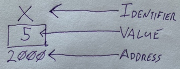
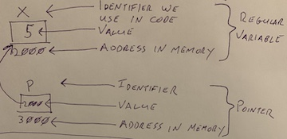

# What's The Point?
## 9/16

### Administrative Stuff
 * I have not had time to peruse the QAF of late, I'm sorry. Turns out taking care of an infant is __hard__. When you get home today, thank whoever took care of you when you were 3 weeks old.
---

### Memory Addresses
 * In order to understand pointers, we need to take a closer look at what a variable is (those of you that had Mr. Holmes for APCS will have a leg up here).
 * There are three key features to any variable in your code:
   1. The __identifier__: Name you use in code to refer to the variable.
   2. The __value__: Data that you store.
   3. The __address__: The location of data in memory.
      * `int x = 5;`
      * 
 * Let's focus on the __address__ (the following explanation is somewhat simplified, the nitty gritty details are not necessary to understand the concept)
   * When your program is run, it is copied into memory.
   * Memory (mostly RAM, though free disk space can be used in place of memory if needed) is broken up into blocks af at least 1 byte.
   * Memory is addressed by starting at the first byte block (1), going up until the last accessible byte.
     * For example, if your computer has 4GB of RAM, then in theory memory addresses would go from 1 to 32,000,000,000.
   * The amount of potential memory addresses is limited by the processor, since a processor must be able to read an entire memory address within a single cycle. For modern, 64-bit computers, this means you could theorhetically have 2^64 bytes of memory, though this number is practically limited by hardware.
   * The address space of a program is determined by the operating system (OS), when the program is run. Therefore it can be different each time.
   * Variables if your program represent chunks of memory. An `int`, for example, will represent a consecutive sequence of 4 bytes starting at a particular memory address.
   * Values are stored within the provided block.
   * In the example above, the variable `x` is located at address 2000. Since an `int` takes up 4 bytes, the value `5` would be made of of three bytes of all `0`, followed by `00000101`. (actually, the order of bytes depends on the [endianness](https://en.wikipedia.org/wiki/Endianness) of the system in question).
   * The next available space in memory would be byte 2004.
   * You can get the address of any variable using the __address of operator__: `&`;
   * The `%p` placeholder character will print out a memory address in hexadecimal format: `printf("x: %d, address of x: %p\n", x, &x);`.
   * If you would prefer to see the address in decimal, you can use the placeholder for an `unsigned long`. (This will most likely result in a warning from gcc): `printf("x: %d, address of x: %lu\n", x, &x);`.
 
---
### Pointers - now the fun really starts.
 * Regular variables are designed to store _values_.
 * Pointers are variables designed to store _memory addresses_.
 * Pointers are variables, meaning they are an identifier for a value stored in memory at a particular address (see above for detail), the only difference is that a pointer is designed to store an address.
 * Pointers must be able to store the value of any potential memory address. On 64 bit computers, this means pointers have to be able to represent 64 bits, or 8 bytes. 
 * Pointers are designed for addresses, which means they are natively `unsigned`.
 * Even though all pointers are the same size, we declare them using the type of the value pointed to.
 * `*` is used to declare a pointer variable.
   * `int *p = &x;`
   * 
   * Here `p` is a pointer variable that stores the address of the variable `x`.
   * Notice that p is a normal variable, and has its own, different, memory address.
   * If you're thinking, "hey, this looks familiar... like object variables in java". You're right! Object variables, or references, are java's pointers. You just don't have as much control over them as we do in C. In fact, think about the error you get when you try to use an uninitialized object variable in java... _null pointer_, meaning the reference stored is 0 (null), which is an invlaid memory address.
 * `*` is also used as the __de-reference operator__. This will return the value stored at the memory address pointed to by the pointer. 
   * Given the definitions of `x` and `p` above:
   * `int y = *p + 10;` would set `y` to the value `15`.
   * `*p = y;` would set the value at the memory address stored in `p` (in the example is 2000), to whatever the value stored in `y` is.
 ___

### Exercises
The following are things you should try in class. This is not an assigment that I will be collecting, but that doesn't mean you shouldn't do it. 

 1. Declare and initialize variables of types `char`, `int`, and `long`.
 2. Print out the addresses of each variable in hex and decimal.
    * Do you notice anything about the addresses?
 3. Declare and initialize pointers for each of your variables.
 4. Print out the values of each pointer.
 5. Use the pointers to modify the values of the original variables and print out the new values.
 Now we venture into the strange & bizzare...
 6. Create a `char *` type pointer.
 7. Initialize that pointer so that it points to the `int` variable declared in step 1. Print out the value of this pointer.
 8. Modify the value pointed to by the pointer declared in step 6.
 9. Print out the value of the original `int`.
 Think about what's going on. It may even help to take out a Key To Success and map out your variables, pointers and values. This is only the beginning, if you have time, see if you can try anything crazier.
