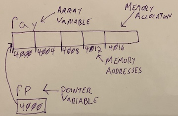

# A Vast Array Of Possibilities
## 9/19

### Administrative Stuff
---

### Array Basics
 * C has arrays, but they are a bit simpler than what you may recall from java.
 * An array is an allocated block of memory meant to hold multiple pieces of data of the same type. As far as C is concerned, this is all an array is. In the same way that a `double` is an 8 byte chunk of memory, an array of 3 `doubles` is a 24 byte chunk of memory, nothing more.
 * C arrays do not have a length attribute/function. We'll see how we can _sometimes_ find the size of an array later on.
 * We will use `[]` to access array elements.
 * The size of an array must be set at declaration and cannot be changed.
 * The size of an array cannot be dyanmic.
   * Importantly, this means you cannot set the size of an array to be the result of a function or other expression that will not be evaluated until the program is run.
 * There is no boundry checking (much more on this later).
 * Array declaraion/access syntax:
   ```C
   float ray[5];
   ray[2] = 8.22;
   ```
 * The above code requests a block of memory large enough for 5 `floats` (20 bytes), which then can be accessed using 0-based `[]` notation.
---

### Array Variables
 * Array _varibles_ (not the arrays themselves) are pointers to the allocated array block.
 * The one difference between array variable pointers and normal pointers is that array variables are __immutable__, meaning that you can never change the memory address an array variable points to.
 * In the above example, `ray` is a variable that points to the beginning of the 20 bytes allocated to that array of floats. We can access each element of that array with `ray[0]`, `ray[1]`, `ray[2]` and `ray[3]`.
 * As mentioned above, we cannot get the length of an array, but we're not totally lost.
   * The `sizeof` function can be used to find the size of a given type (like `float` or `char *`), or _the amount of memory associated with a given variable.
   * `sizeof(ray)` would return `20`.
   * `sizeof(ray) / sizeof(float)` would return `4`, and essentially get you the length. It is more standard in C _not_ to use this, instead using other constants/variables to keep track of array sizes. Since array sizes must be set at compile time, you're more likely to see something like this:
     ```C
     int ARR_SIZE = 10;
     double trouble[ ARR_SIZE ];
     ```
   * In this example, `ARR_SIZE` would be used whenever we needed the length of the array.
 * Since array variables are pointers, we can assign normal pointers to array variables.
   ```C
   float ray[5];
   float *rp = ray;
   ```
 * This code creates an array of 5 floats, and a separate pointer variable that points the beginning of the array.
 * 
 * In this example, `rp` has a value of `4000`, which allows it to point to the beginning of the allocation created for `ray`.
 * `ray`, is immutable, so we could not do soemthing like `ray++`, but `rp` is a normal pointer, so we could do `rp++`. Due to _pointer arithmetic_, `rp++` would actually add `4` to `rp`.
 * `sizeof(ray)` would return `20`, while `sizeof(rp)` would return `8`, since `rp` is a pointer and only holds an 8 byte (on most systems) memory address.
 * This is commonly done, and because of pointer arithmetic, you can iterate through an array by using a pointer and incrementing it.
---

### Array Indexing and `[]` Notation
 * So pointers can be easily used to traverse arrays. In fact the following two lines of code perform the same task.
   * `ray[3]`
   * `*(rp + 3)`
 * In the second line here, we add `3` to `rp`, using the values from the earlier example, that would return memory address `4012`, which is the same address as the location for `ray[3]`, the de-reference operator (`*`), is then used to retrieve the value.
 * In fact, you can think of the standard `[]` notation in terms of specifying an offset from the beginning memory address of an array.
 * Arrays are 0-indexed because the first element is stored at the starting address, so you need not add to get to the correct memory address.
 * A couple important implications of this:
   * The `a[i]` notation is actually shorthand for `*(a + i)`, which means that you can use `[]` with pointer variables as well. This means that `rp[3]` is valid code. In fact, you could use `[]` on pointer variables regardless of if they point to an arry.
   * You can write `ray[-1]` or `rp[-1]`, which would go to the value 4  bytes (one float size) before the beginning of your array. Using the example values again, this would be address `3096`.
   * If you use an index past the end of an array allocation, you will be attempting to access the memory addresses past the end of the array.
   * In either case, going past an array allocation on either end is not advised. Your code will compile, but when run, at best you'll access other variables within the program, at worst, you'll crash.
   * __WARNING: HORRIBLE SYNTAX AHEAD__
     * Once again, `*(a + i)` is the same as `a[i]`
     * `+` is a commutative operations, meaning `a + i` == `i + a`
     * ...
     * `*(a + i)` == `*(i + a)`
     * `*(i + a)` == `i[a]`
     * So `ray[2]` can also be written as `2[ray]`. Try it once, then NEVER DO IT AGAIN!
---

### Random Numbers (unrelated)
 * This is needed for the assignment.
 * Note: On some systems, you may be able to use other functions than the ones described below, but they are not standard for linux, so you should stay away from them for now.
 * Generating a random number in C requires 2 steps
 1. Seeding the random number generator
    * `srand( time(NULL) );`
      * `srand(<SEED>)` seeds the random number generator with the provided argument.
      * If you use the same argument to `srand()` multiple times, you will get the exact same sequence of random numbers.
      * `time(NULL)` will return the current [EPOCH](https://www.epochconverter.com) time, it is commonly used with `srand()` to get new random sequences.
 2. Getting a random number
    * `int x = rand();`
    * Returns the next random number in the sequence seeded by `srand()`.
    * Returns an `int`.
 * `srand()` and `rand()` are both in `<stdlib.h>`
 * `time()` is in `<time.h>`

### Assignment: The Old Switcheroo
 1. Create an array large enough to store 10 ints.
 2. Populate the array with random values.
 3. Set the last value in the array to 0.
 4. Print out the values in this array
 5. Create a separate array large enough to store 10 ints.
 6. USING ONLY POINTERS (that is, do not use the array variables) do the following:
    * Populate the second array with the values in the first but in reverse order
    * Print out the values in the second array

For this assignment, _do not create helper functions, put everything inside main_ (it won't be too long). We will talk about passing arrays and pointers are function arguments in a few days.

Assignment link: https://classroom.github.com/a/sm1GghCe
